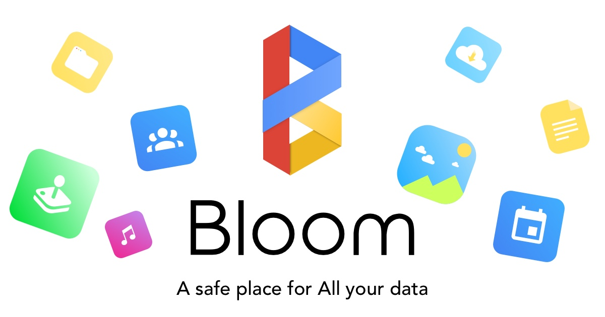

Whether you are an aspiring employee, a contributor, a journalist, a youtuber, an investor or even
a competitor, this guide is for you.

**It's Bloom's sacred book**.

It contains **all** you need to know about the vision, how we run the organization, the projects management, the specs,
and even resources to improve your engineering/management/finance/... skills, backed by real life experience.

All employees and contributors are expected to improve The Guide whenever they notice something wrong.
Please use [issues](https://gitlab.com/bloom42/wiki/issues) for this purpose.

# Index

* [Home](home)
* [Organization](organization)
* [Engineering](engineering)
* [People group](people-group)
* [Finance](finance)
* [Legal](legal)
* [Marketing](marketing)
* [Ideas](ideas)

# Other wikis

Some projects have their own wiki

* [Bloom](https://gitlab.com/bloom42/bloom/-/wikis/home)
* [Authenticator](https://gitlab.com/bloom42/authenticator/-/wikis/home)
* [Crypto42](https://gitlab.com/bloom42/libs/crypto42/-/wikis/home)
* [SANE](https://gitlab.com/bloom42/sane/-/wikis/home)